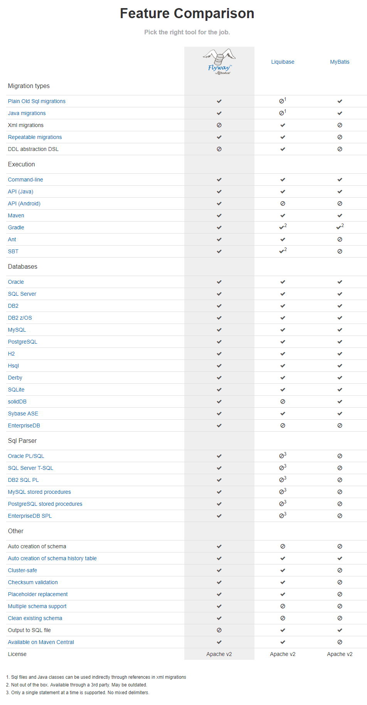

Liquibase 是什么
---------------

引用 [Liquibase 官网](http://www.liquibase.org/index.html) 的一张图片：


类似的工具还有 [Flyway](https://flywaydb.org/)。


为什么选择 Liquibase
------------------

[Flyway 官网](https://flywaydb.org/) 上有一个同类工具特性的对比，详见 `Feature Comparison` 部分或下图：



看图的话，Flyway 完胜，不过 **等等！看完下面内容再做决定**：

* [Liquibase vs Flyway which one to use?](https://stackoverflow.com/questions/37385823/liquibase-vs-flyway-which-one-to-use)
* [Tool-based Database Refactoring: Flyway vs. Liquibase](https://reflectoring.io/database-refactoring-flyway-vs-liquibase/)
* [Java世界最棒的DB Migration Tool](http://ju.outofmemory.cn/entry/85903)

一句话总结一下：

```
面向 SQL，选择 Flyway
不面向 SQL，选择 Liquibase
```

How to use?
-----------

Liquibase 的使用方式可参考官方提供的 [Quick Start](http://www.liquibase.org/quickstart.html) 文档，这里主要讲一下 **Liquibase 和 Spring 集成使用的方式**。

### 入口 bean

```
<bean id="liquibase" class="liquibase.integration.spring.SpringLiquibase" lazy-init="false">
    <property name="dataSource" ref="dataSource"/>
    <property name="changeLog" value="classpath*:liquibase/changelog.xml"/>
    <property name="contexts" value="${database.liquibase.profile}"/>
</bean>
```

需要注意几点：

1. 数据库的变更最好在应用启动时进行，所以需要给入口 bean 配置上 `lazy-init="false"`
1. Spring 提供的 [profiles](http://propersoft-cn.github.io/pep-refs/projects/spring-framework/4.3.0/index.html#beans-definition-profiles) 机制可以对应到 Liquibase 的 [Contexts](http://www.liquibase.org/documentation/contexts.html) 上，以便在不同的 profile 执行不同的数据库操作
1. 大型项目一般都会分模块，模块最终可能会以 jar 包方式被引用。入口 changelog.xml 可能也是存在于 jar 包中的。故 `changeLog` 属性的 `value` 配置为 `classpath*:liquibase/changelog.xml`。**想法很不错，但这里会遇到一个问题：`CORE-3139`**

#### CORE-3139

[CORE-3139](https://liquibase.jira.com/browse/CORE-3139) 是 Liquibase 无法从 JAR 包中读取资源文件的一个 bug。这个 bug 已有 [PR #725](https://github.com/liquibase/liquibase/pull/725) 进行了处理，CORE-3139 中也标记这个问题已在 Liquibase `v3.5.4` 版本中修复，但事实证明在 [Liquibase v3.6.1](https://github.com/liquibase/liquibase/tree/liquibase-parent-3.6.1) 版本中仍然存在，且之前修复这个问题的代码也基本都被覆盖掉了 orz。

这个问题只会影响到从 JAR 包中读取资源文件的情况（比如 changelog.xml 在 JAR 包中），资源直接存在于文件系统时并不受此问题影响。

为了避免这个问题再反复出现，新提交了一个 [PR #767](https://github.com/liquibase/liquibase/pull/767) 对问题进行了修正，并补充了单元测试。如需将 changelog 打入 JAR 包中，可使用合并了此 PR 的版本的 Liquibase。

### Change Log 的组织


- [ ] includeAll


版本
---

* [liquibase v3.6.1](https://github.com/liquibase/liquibase/tree/liquibase-parent-3.6.1)
* [liquibase-gradle-plugin v1.2.4](https://github.com/liquibase/liquibase-gradle-plugin/tree/acf7a693563471f83fd26b9e15365ab98011d804)

Change Log Template
-------------------

```
<?xml version="1.0" encoding="UTF-8" standalone="no"?>
<databaseChangeLog xmlns="http://www.liquibase.org/xml/ns/dbchangelog"
                   xmlns:xsi="http://www.w3.org/2001/XMLSchema-instance"
                   xsi:schemaLocation="http://www.liquibase.org/xml/ns/dbchangelog
                                       http://www.liquibase.org/xml/ns/dbchangelog/dbchangelog-3.6.xsd">
    <changeSet author="alphahinex" id="20180515-1">
      ...
    </changeSet>
</databaseChangeLog>
```

### 新增数据

1. 在数据库中执行 insert 语句
1. 修改 build.gradle 中配置的 liquibase.runList，将其值改为 'genDevData'
1. `./gradlew generateChangelog`
> 需确保 db/dev-data.xml 不存在，否则会报错
1. 从 `db/dev-data.xml` 中找到新增数据的 changeSet，并放至相应模块的 change log 文件中

参考资料
-------

1. [Liquibase](https://github.com/liquibase/liquibase)
1. [Liquibase Documentation](http://www.liquibase.org/documentation/index.html)
1. [liquibase-gradle-plugin](https://github.com/liquibase/liquibase-gradle-plugin)
1. [Why not use HBM2DDL?](https://github.com/liquibase/liquibase-hibernate/wiki#why-not-use-hbm2ddl)
